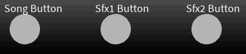

# Club Cyberia - Games Programming Project 2023

Team Members: Simon Kondela, Nickita Kolesnikov, Cian Halpin, Kal Boylan

Team Student Numbers: C22750719, C22767449, C22391966, C22493676

## Description of the project

***Club Cyberia*** is an audio visualizer made in the spirit of clubs and DJ-ing, The visuals and UI elements are meant to evoke the image of standing behind a DJ table were you control the music.
Indiviudal elements of the visualizer are as follows:

- DJ Booth with buttons which control the music this includes a Play/Pause button and sfx buttons.
- Background which draws dots which react to the music by speeding up and shifting their colors.
- 3D mesh spheres as the main visual indicators of sound which showcase each individual audio track (music and the two respective sfx channels).

*Pretty cvnt* by the australian music producer *Sewerslvt* is the song used in this project. We chose this song for it's high energetic tempo and as it is from a genre of music called Breakcore which is closely related to Drum and Bass a genre popular in clubs, these facts further enhance the feeling we were aiming for.

###Showcase video [here](https://youtu.be/Od_UB0CNuQc)

## Instructions for use

When starting the project you will see a dark screen which a gray bar at the bottom this is the DJ table.
You have 3 buttons to choose from:

- The Song button - Starts and stops the music and with it the visualizer
- SFX 1 Button - Plays an airhorn sound effect 
- SFX 2 Button - Plays an record scratch sound effect

Left of the button controls you will see volume sliders which will change the volume of parts of the audio. They change the volume of the tracks as follows:

- Volume of the music
- Volume of the airhorn
- Volume of the record scratch

The volume sliders also influence the base size of their sphere objects. 

## List of classes/assets in the project 

| Class/asset | Source | Notes |
|-----------|-----------|--------------------|
| musicproject.pde | Self written | The main class which calls all the other elements of the project |
| background.pde | Self written | Handles the individual background elements |
| backgroundElement.pde | Self written | Draws and updates the individual rings of dots in the background |
| sphere.pde | Self written | Draws the sphere which reacts to music |
| button.pde | Self written | Handles the button UI |
| volumeCtrl.pde | Self written | Volume sliders for the individual audio tracks (& sfx) |
| Sewerslvt - Pretty Cvnt.mp3 | [Source](https://www.youtube.com/watch?v=beoNy4MMHTc) | The main song |
| Airhorn.mp3 | [Source](https://www.youtube.com/watch?v=3ABi1zfK4qc&ab_channel=ItzChristy) | Airhorn SFX |
| Scratch1.mp3 | [Source](https://www.youtube.com/watch?v=3Lra0087Rac&ab_channel=CoolSoundFX) | Record scratch SFX |
